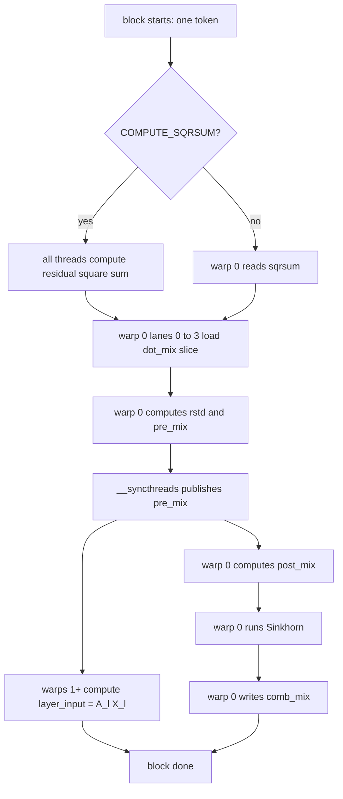

## The Hyper Connection Preprocessing GPU Kernel Study

This document summarizes my study of the GPU kernels used for the hyper-connection (mHC) preprocessing in FlashInfer's DeepSeek V4. It covers my exploration of the reference implementation, the GPU optimization techniques involved (like split-K and tiling), and notes on how these kernels work to support the mHC design.
 

**Figure 1 — mHC dataflow diagram**

this diagram i found on flashinfer's discussion forum is a useful visual reference for understanding the data flow and operations in the mHC preprocessing.

**disclaimer:** Claude Opus 4.8 was used to assist my research, as I am not an expert in GPU programming. However this document is 100% my own work and I have done my best to understand the GPU kernels and optimizations used in FlashInfer's DeepSeek V4.

## mhc_pre_big_fuse.cu

I will be going through my understanding of the [mhc_pre_big_fuse kernel](https://github.com/flashinfer-ai/flashinfer/pull/3285). this is an implementation that was merged to flashinfer very recently. I will then explain the optimizations that were made to this kernel and how they improve performance.

### the math operation
please reference my math document for a better understanding on **why** these operations are needed, and what mHC (manifold-constrained hyper connection) is.
it is available [here](../2026-06-21-mhc-theory)

for now, I will be assuming you have already went through that resource. Here is how the variables in the math document map to the variables in the kernel code:

**Table 1 — Variable map**

| Math Definition | Kernel Variable | Data Type | Dimensions | Description |
|---|---|---|---|---|
| $X_l$ | `residual` | `__nv_bfloat16` | $n_{hc} \times d$ | The input tensor. |
| $X_l W_l^{\mathrm{fused}}$ | `dot_mix` | `float` | $1 \times (n_{hc} + n_{hc}^2 + n_{hc})$  | The raw output of the fused GEMM projection (calculated before this kernel launches). |
| $A_l = \sigma(\tilde A_l) + \epsilon$ | `pre_mix` | `float` | $1 \times n_{hc}$ | The compression vector. |
| $C_l = 2\cdot\sigma(\tilde C_l)$ | `post_mix` | `float` | $n_{hc} \times 1$ | The expansion vector. |
| $B_l = \operatorname{Sinkhorn}(\tilde B_l)$ | `comb_mix` | `float` | $n_{hc} \times n_{hc}$ | The doubly-stochastic routing matrix. |
| $A_l X_l$ | `layer_input` | `__nv_bfloat16` | $1 \times d$ | The compressed tensor sent to the MoE/Attention block. |
| $\alpha_l^{\text{pre}},\ \alpha_l^{\text{post}},\ \alpha_l^{\text{comb}}$ | `mhc_scale[0...2]` | `float` | $3$ (scalars) | The learnable scalar multipliers for the dynamic components. |
| $S_l^{\text{pre}},\ S_l^{\text{post}},\ S_l^{\text{comb}}$ | `mhc_base[...]` | `float` | $1 \times (n_{hc} + n_{hc}^2 + n_{hc})$| The static component offsets. |
| $\operatorname{RMS}(X_l)^{-1}$ | `rstd` | `float` | $1$ (scalar) | The reciprocal standard deviation used to finalize the RMSNorm. |

refresher on $W_l^{\mathrm{fused}}$:

this is a weight matrix, made by concatonating the three weight matrices $W_l^{\text{pre}}, W_l^{\text{post}}, W_l^{\text{comb}}$ along the first dimension. Instead of computing three separate GEMM operations, we can compute one fused GEMM operation to get the same result. This is a common optimization technique in deep learning.

this is included in the math document, but I thought I'd give a refresher.

### template parameters:
```cpp
template <int NUM_SPLITS, int BLOCK_SIZE, bool COMPUTE_SQRSUM>
```
passing these as template parameters, allows them to be locked at compile time, and the compiler can unroll loops and hardwire memory offsets.

### launch bounds:

```cpp
__launch_bounds__(BLOCK_SIZE)
```
this is an upper bound on the number of threads per block that will be launched for this kernel. the compiler can aggressively optimize for this number of threads instead of being conservative.

### function declaration:
```cpp
__global__ void mhc_pre_big_fuse_kernel(...)
```

standard cuda kernel declaration. the variables were already explained in the table above.

#### special flags used:
```cpp
const float* __restrict__ dot_mix, 
const __nv_bfloat16* __restrict__ residual,
```
restrict promises the compiler that these pointers are not aliased. meaning, they'll never point at the same memory. Without this, the compiler won't pull data from these addresses to read only caches for optimization.

### hardware data types:
```cpp
__nv_bfloat16, float
```

**Table 2 — Hardware data types**

| Type | Bits | Exponent | Mantissa | Approx. Range | Notes |
|---:|:---:|:---:|:---:|:---|---|
| `fp32` (IEEE-754) | 32 | 8 | 23 | ~1e±38 | Single precision; standard for training and many kernels. |
| `fp16` (IEEE-754 half) | 16 | 5 | 10 | max ≈ 6.55e4 | Lower precision and range; accelerated on Tensor Cores (fast but reduced numeric fidelity). |
| `bfloat16` | 16 | 8 | 7 | ~1e±38 | Same exponent as `fp32` (large dynamic range) with reduced precision — often helps training stability. |
| `__nv_bfloat16` | 16 | 8 | 7 | ~1e±38 | NVIDIA CUDA bfloat16 type; hardware-accelerated on many modern NVIDIA GPUs (data-center architectures). |


as documented in Table 1, params like the mix vectors, and rstd are kept in high precision, as they are used in operations that require full numerical accuracy.
but where possible ((for example the residual itself), we use the lower-precision `__nv_bfloat16` type to save memory bandwidth and storage, while still maintaining a large dynamic range.

### static asserts

```cpp
static_assert(NUM_SPLITS == 1 || !COMPUTE_SQRSUM,
              "internal sqrsum path only supports NUM_SPLITS=1");
```
static_assert acts as a fail-safe. It stops the code from even compiling if someone tries to launch the kernel with an unsupported combination of optimizations. 

### high level overview of the kernel and the optimizations applied
#### one token = one block
each thread block is responsible for processing one token.

this makes things simpler, because my math document (and the deepseek paper) both describe the mHC operations on a per-token basis. so we can directly map the math to the code without worrying about how multiple tokens are handled within a block.

#### warp 0 vs warps 1+

the kernel is designed such that warp 0 (specifically the first 4 threads in the block) is responsible for computing the metadata (the mix vectors and the routing matrix), while warps 1+ are responsible for the reduction to compute the final output.


```cpp
const int warp_id = threadIdx.x / kWarpThreads;
const int lane = threadIdx.x & (kWarpThreads - 1);
const bool meta_lane = (warp_id == 0 && lane < kHc4);
```

`kHc4 = 4`, meaning this kernel is specialized for exactly 4 hyper-connection lanes.

### constants in the kernel

at the top of the file we have:

```cpp
static constexpr int kHc4 = 4;
static constexpr int kMixHc4 = kHc4 * (2 + kHc4);
static constexpr int kWarpThreads = 32;
static constexpr int kVecWidth = 8;
```

these constants tell us a lot about how the kernel is designed.

**Table 3 — Kernel constants**

| Constant | Value | Meaning |
|---|---|---:|---|
| `kHc4` | 4 | number of hyper-connection lanes. |
| `kMixHc4` | 24 | total metadata values per token: 4 pre + 4 post + 16 comb. |
| `kWarpThreads` | 32 | CUDA warp size. |
| `kVecWidth` | 8 | each vectorized load/store handles 8 bf16 values. |

why `kMixHc4 = 24`?

$$
4 + 4 + 4^2 = 24
$$

this is exactly:

$$
A_l \text{ params} + C_l \text{ params} + B_l \text{ params}
$$

so for every token, `dot_mix` stores 24 float values generated by the previous fused GEMM.

### vectorized bf16 loads and stores

the kernel defines a small helper struct:

```cpp
struct Bf16x8 {
  uint4 raw;
};
```

`uint4` is 4 unsigned 32-bit values, so total size is:

$$
4 \times 32 = 128 \text{ bits} = 16 \text{ bytes}
$$

since bf16 is 16 bits, 16 bytes contains:

$$
16 \text{ bytes} / 2 \text{ bytes per bf16} = 8 \text{ bf16 values}
$$

this is why it is called `Bf16x8`.


```cpp
asm volatile("ld.global.v4.u32 {%0, %1, %2, %3}, [%4];\n" ...)
asm volatile("st.global.v4.u32 [%4], {%0, %1, %2, %3};\n" ...)
```

Here, we use inline PTX assembly. We force the compiler to load 128-bits of data (in the form of a vector of 8 bf16 values)from the global memory, utilizing the whole bus. this is known as "manual emission".


### square sum and RMSNorm

there are two ways the kernel can get the RMSNorm denominator.

#### path 1: sqrsum is already provided

in the normal `mhc_pre_big_fuse` function, `sqrsum` is passed in from outside:

```cpp
const float* __restrict__ sqrsum
```

if `COMPUTE_SQRSUM == false`, then the kernel does:

```cpp
sq_total = sqrsum[token];
```

or if split-K was used:

```cpp
sq_total += sqrsum[s * total_tokens + token];
```

so the square sum was computed before this kernel, probably during the previous projection/reduction stage.

#### path 2: compute sqrsum inside this kernel

there is also a `mhc_pre_big_fuse_with_prenorm` function. In that path, the kernel launches with:

```cpp
dispatch_pre_big_fuse<1, true>(...)
```

so `COMPUTE_SQRSUM = true`.

then the kernel runs:

```cpp
const float local_sq = residual_square_sum_vec8<BLOCK_SIZE>(residual_token, kHc4 * H);
sq_total = block_sum<BLOCK_SIZE>(local_sq, sq_partials);
```

this streams through the residual tensor, squares every element, and reduces it inside the block. "reducing" here means taking the sum across the feature dimension, so we end up with the total sum of squares for that token. This is callde a "reduction" operation in parallel programming, because we are reducing a large set of values down to a single value (the total sum).

mathematically this is computing:

$$
\sum_i X_i^2
$$

then the reciprocal RMS is:

```cpp
rstd = rsqrtf(sq_total / static_cast<float>(K) + rms_eps);
```

which maps to:

$$
rstd = \frac{1}{\sqrt{\frac{1}{K}\sum_i X_i^2 + \epsilon}}
$$

this is exactly the denominator of RMSNorm.

### block reduction details

there are two reduction helpers:

```cpp
warp_sum(float v)
block_sum<BLOCK_SIZE>(float v, float* shared)
```

`warp_sum` uses warp shuffle instructions:

```cpp
v += __shfl_down_sync(0xffffffffu, v, offset);
```

this reduces values inside one warp without shared memory. This is faster than writing every partial sum to shared memory, because warp lanes can exchange register values directly.

`block_sum` then does a two-stage reduction:

1. every warp reduces its own lanes using `warp_sum`
2. lane 0 of each warp writes a partial sum to shared memory
3. warp 0 reduces those warp-level partial sums
4. thread 0 publishes the final result back into shared memory

this is a standard fast block reduction pattern.

### original path vs my h100 path

there are two versions of the metadata generation in the same kernel. The first one is the original/general implementation, and the second one is the H100-specific path I added after looking through the generated code and profiling behavior.

```cpp
#if defined(__CUDA_ARCH__) && (__CUDA_ARCH__ == 900)
  // Hopper fast path
#else
  // Portable path
#endif
```

`__CUDA_ARCH__ == 900` means the code is being compiled for sm90, which is H100/Hopper. This lets us keep the original path available for other architectures, while specializing the hot path for the hardware I was targeting.

#### the original/general path

the original code took a general path, with decent portability and readable structure. here, warp 0 uses a local array:

```cpp
float y_local[kMixHc4];
```

that is 24 floats.

$$
24 \times 4 \text{ bytes} = 96 \text{ bytes}
$$

then it loads the full metadata row:

```cpp
for (int c = 0; c < kMixHc4; ++c) {
  y_local[c] = y_row[c];
}
```

and calls:

```cpp
write_token_metadata(y_local, rstd, ...)
```

this code is clean, and it matches the math nicely. But the issue I found is that the helper function uses lane-dependent indexing:

```cpp
y_local[lane]
y_local[kHc4 + lane]
y_local[2 * kHc4 + lane * kHc4 + k]
```

from the programmer's perspective this is obvious: lane 0 handles row 0, lane 1 handles row 1, etc.

but from the compiler's perspective, `lane` is dynamic. It is not a compile-time constant. The compiler may not be able to keep the whole `y_local` array in registers, because indexing into an array with a dynamic index often forces it to put that array into local memory.

Note: CUDA "local memory" is not the same as a CPU local variable. It usually spills to global memory and is cached. So if `y_local` spills, the metadata warp now has extra global-memory traffic just to access 96 bytes of temporary values.

this was in fact occouring when I inspected the `cuobjdump` output `STACK:96`. I could see the register spill/local-memory behavior there, even though I could not dynamically inspect it with Nsight on an H100. That was the first clue that the nice modular helper function was costing us real performance.

I verified after the fix and `STACK:0, LOCAL:0` there was no local memory spill, and the kernel was now fully register-resident for the metadata work.

The second clue was the warp scheduling. Warps 1+ were blocked at the barrier while warp 0 finished all the metadata work, including the Sinkhorn loop. So the kernel had two problems:

1. warp 0 was slower than it needed to be because of the local-memory spill.
2. the rest of the block was waiting for warp 0, even though it only needed `pre_mix`.

I used claude to confirm these observations, and breakdown how to fix the issue.

#### my h100 path

on H100, I changed the path to avoid the `y_local[24]` temporary and instead keep only what each lane actually needs.

for each metadata lane:

```cpp
float y_pre = 0.0f;
float y_post = 0.0f;
float cmv[kHc4];
```

so lane 0 only holds the row needed for lane 0, lane 1 holds the row needed for lane 1, and so on.

for `NUM_SPLITS == 1`, the load is:

```cpp
y_pre = y_row[lane];
y_post = y_row[kHc4 + lane];
for (int k = 0; k < kHc4; ++k) {
  cmv[k] = y_row[2 * kHc4 + lane * kHc4 + k];
}
```

this is much more register friendly. `cmv[k]` is accessed with unrolled constant `k`, and there is no 24-element array indexed by a dynamic lane id. The goal was very direct: keep the metadata slice in registers and stop paying local-memory traffic for a tiny 96-byte temporary.

for split-K, it accumulates the same slice across splits:

```cpp
for (int s = 0; s < NUM_SPLITS; ++s) {
  sq_total += sqrsum[s * total_tokens + token];
  const float* y_row = dot_mix + (s * total_tokens + token) * kMixHc4;
  y_pre += y_row[lane];
  y_post += y_row[kHc4 + lane];
  for (int k = 0; k < kHc4; ++k) {
    cmv[k] += y_row[2 * kHc4 + lane * kHc4 + k];
  }
}
```

this is the same idea for split-K. each split produces a partial `dot_mix`, and this path accumulates only the values this lane owns instead of rebuilding the full 24-float row.

### explaining split-K

for one token, the fused projection is:

$$
\hat{X_l} W_l^{fused}
$$

but $\hat{X_l}$ is huge because it is the flattened 4-lane residual:

$$
\hat{X_l} \in R^{1 \times (4d)}
$$

and for DeepSeek-style hidden sizes, $d$ can be very large.

Split-K means the previous GEMM can split the long K dimension into chunks. Each chunk computes a partial dot product, and then this kernel adds those partial dot products:

$$
dot\_mix = \sum_s dot\_mix^{(s)}
$$

same for the square sum:

$$
sqrsum = \sum_s sqrsum^{(s)}
$$

why this helps: if the GEMM is too skinny or has too few output columns (only 24 values per token), split-K can create more parallel work for the GPU. It trades an extra reduction for better occupancy/utilization in the projection stage.

### computing pre_mix early

this was the second optimization I made. After fixing the register/local-memory issue, the next obvious waste was that most of the block was just sitting at the barrier.

The old logical order was:

1. load all metadata
2. compute `pre_mix`
3. compute `post_mix`
4. run Sinkhorn for `comb_mix`
5. `__syncthreads()`
6. compute `layer_input = A_l X_l`

that is easy to read, but bad for overlap. Warps 1+ are idle while warp 0 does all the scalar metadata math.

The thing I noticed is that warps 1+ do not need all metadata. They only need `pre_mix`, because their job is just:

$$
layer\_input = A_l X_l
$$

so I changed the order:

1. warp 0 loads metadata slice
2. warp 0 computes only `pre_mix`
3. `__syncthreads()` publishes `pre_mix`
4. warps 1+ start computing `layer_input`
5. meanwhile, warp 0 computes `post_mix` and `comb_mix`

the code now reflects that split:

```cpp
if (meta_lane) {
  ...
  rstd = rsqrtf(...);
  const float v = y_pre * rstd * mhc_scale[0] + mhc_base[lane];
  pre_mix[lane] = 1.0f / (1.0f + expf(-v)) + mhc_pre_eps;
}

__syncthreads();

if (meta_lane) {
  // post_mix and Sinkhorn happen here
}

write_layer_input<BLOCK_SIZE>(...);
```

after this, the kernel no longer waits for the Sinkhorn loop before starting the heavy memory streaming work.

main idea: move the barrier to the first real dependency. not after all metadata is done, only after `pre_mix` is ready.

### execution timeline

here is the optimized execution flow:



this diagram is a bit simplified, but the key idea is that after the barrier, two independent pieces of work happen at the same time:

- warp 0 does scalar-heavy metadata work
- warps 1+ do bandwidth-heavy residual compression

### computing $A_l$ (pre_mix)

The pre-mix gate is:

$$
A_l = \sigma(\tilde A_l) + \epsilon
$$

in code:

```cpp
const float v = y_pre * rstd * mhc_scale[0] + mhc_base[lane];
pre_mix[lane] = 1.0f / (1.0f + expf(-v)) + mhc_pre_eps;
```

mapping:

| Math | Code |
|---|---|
| dynamic projection output | `y_pre` |
| RMSNorm scaling | `rstd` |
| dynamic scale | `mhc_scale[0]` |
| static base | `mhc_base[lane]` |
| non-zero floor | `mhc_pre_eps` |

so:

$$
\tilde A_l = y_{pre} \cdot rstd \cdot \alpha_l^{pre} + S_l^{pre}
$$

$$
A_l = \sigma(\tilde A_l) + \epsilon
$$

### computing $C_l$ (post_mix)

After the barrier, warp 0 computes post-mix:

```cpp
const float vp = y_post * rstd * mhc_scale[1] + mhc_base[kHc4 + lane];
post_mix[token * kHc4 + lane] =
    1.0f / (1.0f + expf(-vp)) * mhc_post_mult_value;
```

mapping:

| Math | Code |
|---|---|
| dynamic projection output | `y_post` |
| RMSNorm scaling | `rstd` |
| dynamic scale | `mhc_scale[1]` |
| static base | `mhc_base[kHc4 + lane]` |
| post multiplier | `mhc_post_mult_value` |

so:

$$
\tilde C_l = y_{post} \cdot rstd \cdot \alpha_l^{post} + S_l^{post}
$$

$$
C_l = mhc\_post\_mult\_value \cdot \sigma(\tilde C_l)
$$

usually `mhc_post_mult_value` should be 2, matching the math document.

### computing $B_l$ (comb_mix)

The comb-mix matrix is the most expensive scalar part of the kernel.

first the raw values are scaled and shifted:

```cpp
for (int k = 0; k < kHc4; ++k) {
  cmv[k] = cmv[k] * rstd * mhc_scale[2] + mhc_base[2 * kHc4 + lane * kHc4 + k];
}
```

this maps to:

$$
\tilde B_l = y_{comb} \cdot rstd \cdot \alpha_l^{comb} + S_l^{comb}
$$

then the code applies softmax row-wise:

```cpp
const float row_max = fmaxf(fmaxf(cmv[0], cmv[1]), fmaxf(cmv[2], cmv[3]));
for (int k = 0; k < kHc4; ++k) {
  cmv[k] = expf(cmv[k] - row_max);
}
float row_sum = cmv[0] + cmv[1] + cmv[2] + cmv[3];
for (int k = 0; k < kHc4; ++k) {
  cmv[k] = cmv[k] / row_sum + mhc_sinkhorn_eps;
}
```

subtracting `row_max` is the standard numerically stable softmax trick. It avoids `expf` overflow.

then it does column normalization using warp shuffles:

```cpp
float col_sum = cmv[k];
col_sum += __shfl_xor_sync(kLaneMask, col_sum, 1);
col_sum += __shfl_xor_sync(kLaneMask, col_sum, 2);
cmv[k] /= (col_sum + mhc_sinkhorn_eps);
```

here `kLaneMask = (1u << kHc4) - 1`, which is:

$$
(1 << 4) - 1 = 15 = 0b1111
$$

so only lanes 0..3 participate in the shuffle.

why `xor 1` and `xor 2`?

with four lanes, xor patterns let each lane exchange values with the other lanes:

- lane 0 exchanges with lane 1 using xor 1
- lane 0 exchanges with lane 2 using xor 2
- after both steps, the value has been combined across lanes 0,1,2,3

this is a tiny 4-lane reduction inside warp 0. Since each lane represents one row of the 4x4 matrix, the shuffle lets the rows communicate to compute column sums.

Then the fixed Sinkhorn loop runs:

```cpp
for (int it = 1; it < sinkhorn_repeat; ++it) {
  row_sum = cmv[0] + cmv[1] + cmv[2] + cmv[3] + mhc_sinkhorn_eps;
  for (int k = 0; k < kHc4; ++k) {
    cmv[k] /= row_sum;
  }
  for (int k = 0; k < kHc4; ++k) {
    float col_sum = cmv[k];
    col_sum += __shfl_xor_sync(kLaneMask, col_sum, 1);
    col_sum += __shfl_xor_sync(kLaneMask, col_sum, 2);
    cmv[k] /= (col_sum + mhc_sinkhorn_eps);
  }
}
```

this produces an approximate doubly-stochastic matrix:

- rows sum to about 1
- columns sum to about 1
- entries are non-negative

finally it writes:

```cpp
comb_mix[token * kHc4 * kHc4 + lane * kHc4 + k] = cmv[k];
```

so each metadata lane writes one row of the 4x4 `comb_mix` matrix.

### computing layer_input $A_l X_l$

this is done by `write_layer_input`.

```cpp
if (warp_id == 0) {
  return;
}
```

warp 0 does not participate. That warp is reserved for metadata. Warps 1+ stream through hidden dimension `H`.

```cpp
const int p2_tid = tid - kWarpThreads;
constexpr int p2_threads = BLOCK_SIZE - kWarpThreads;
for (int h = p2_tid * kVecWidth; h < H; h += p2_threads * kVecWidth) {
  ...
}
```

`p2_threads` means "phase 2 threads" or the threads after warp 0. If block size is 256, then:

$$
p2\_threads = 256 - 32 = 224
$$

so 224 threads are used to sweep across the hidden dimension.

For each position `h`, the kernel loads the same hidden slice from all 4 lanes:

```cpp
for (int j = 0; j < kHc4; ++j) {
  const Bf16x8 raw = load_bf16x8(residual + j * H + h);
  ...
  acc[...] += pre_mix[j] * f.x;
}
```

mathematically:

$$
layer\_input[h] = \sum_{j=0}^{3} pre\_mix[j] \cdot residual[j,h]
$$

or in the notation from the math document:

$$
layer\_input = A_l X_l
$$

finally it converts the fp32 accumulator back to bf16:

```cpp
pairs[v] = __float22bfloat162_rn(make_float2(acc[2 * v], acc[2 * v + 1]));
store_bf16x8(layer_input + h, out);
```

important detail: accumulation is done in fp32 even though inputs/outputs are bf16. This is the usual mixed precision pattern: bf16 for bandwidth, fp32 for accumulation accuracy.

### elaborating on the barrier in pre_mix

there is still a `__syncthreads()` after `pre_mix` is written.

this is required because `pre_mix` is in shared memory:

```cpp
__shared__ float pre_mix[kHc4];
```

warp 0 writes it, and warps 1+ read it.

without the barrier, warps 1+ could read uninitialized or partially written `pre_mix` values. So the barrier cannot be removed entirely.

but the key optimization is that the barrier was moved earlier. It only waits for `pre_mix`, not for the full metadata generation.

### memory layout assumptions

The shape checks at the bottom tell us the expected tensor layouts.

```
residual:    [total_tokens, 4, H] bf16
post_mix:    [total_tokens, 4] float
comb_mix:    [total_tokens, 4, 4] float
layer_input: [total_tokens, H] bf16
mhc_scale:   [3] float
mhc_base:    [24] float
```

and `H` must be divisible by 8:

```
TVM_FFI_ICHECK_EQ(*H % kVecWidth, 0) << "hidden size must be divisible by 8";
```

this is because all global memory loads/stores in the layer input path use `Bf16x8` vectorization. If `H` was not divisible by 8, the last vector load could run past the end.

### block size choices

there are two default block size selectors:

```cpp
static int select_pre_big_fuse_block_size(int /* total_tokens */) { return 256; }
static int select_pre_big_fuse_with_prenorm_block_size(int /* total_tokens */) { return 128; }
```

normal path uses 256 threads. prenorm path uses 128 threads.

my understanding:

- in the normal path, sqrsum is already available, so most of the work after metadata is the `layer_input` bandwidth sweep. 256 threads gives 224 useful memory threads after reserving warp 0.
- in the prenorm path, the kernel also computes sqrsum internally. This adds a block-wide reduction and may increase register/shared-memory pressure. 128 threads can be a better tradeoff.

also, the dispatch supports 128, 256, and 512 block sizes if the caller overrides it.

```cpp
if (block_size >= 512) launch 512
else if (block_size >= 256) launch 256
else launch 128
```

### launch and split dispatch

`num_splits` is dispatched at compile time:

```cpp
switch (num_splits) {
  case 1:  DISPATCH_SPLITS(1);  break;
  case 2:  DISPATCH_SPLITS(2);  break;
  case 4:  DISPATCH_SPLITS(4);  break;
  case 8:  DISPATCH_SPLITS(8);  break;
  case 16: DISPATCH_SPLITS(16); break;
}
```

this is important because `NUM_SPLITS` is a template parameter. If it was a runtime loop bound, the compiler would have a harder time unrolling the accumulation loop and optimizing address arithmetic.

supported split counts are powers of two up to 16.

### why this kernel is called pre

from the full mHC equation:

$$
X_{l+1} = B_l X_l + C_l F_l(A_l X_l)
$$

this kernel computes the things needed **before** the expensive block $F_l$:

1. `pre_mix = A_l`
2. `layer_input = A_l X_l`
3. `post_mix = C_l`
4. `comb_mix = B_l`

The next heavy block (attention or MoE) consumes `layer_input`. Later, a post kernel can use `post_mix`, `comb_mix`, the old residual, and the block output to form:

$$
B_l X_l + C_l F_l(A_l X_l)
$$

so "pre" does not mean it only computes $A_l$. It also prepares `B_l` and `C_l`, but the critical output for the immediate next compute block is `layer_input`.

### performance intuition on H100

H100 / sm90 is very good at keeping many operations in flight, but only if the kernel exposes independent work.

The original schedule made the work more serial:

```
metadata math -> barrier -> residual compression
```

My H100 path changes this into:

```
pre_mix -> barrier -> metadata math and residual compression in parallel
```

breaking down the work happening in parallel:

| Work | Mostly uses | Notes |
|---|---|---|
| Sinkhorn metadata | scalar fp32 math, `expf`, warp shuffles | tiny data, lots of dependent math |
| layer_input reduction | global memory bandwidth, bf16 conversion, fp32 FMA | large data stream over `H` |

so the scheduling change gives the SM something useful to do while warp 0 is still finishing the Sinkhorn math.

The other big improvement is the register/local-memory issue. A 96-byte local array sounds tiny, but in the `cuobjdump` output it showed up as a real spill. That spill was extra traffic in the exact part of the kernel that everyone else was waiting on. So fixing it mattered more than the size of the array suggests.

## Results

The two changes — spill elimination and Sinkhorn overlap — were applied to the `mhc_pre_big_fuse` kernel in FlashInfer PR #3285. All 26 existing tests continued to pass.

| Configuration | Baseline | Optimized | Speedup | SOL Change |
|---|---|---|---|---|
| N=4096, H=4096 (pure) | 74.9 µs | 57.3 µs | **1.31×** | 67% → 88% |
| N=4096, H=7168 (pure) | 112.0 µs | 97.0 µs | **1.15×** | 78% → 91% |
| N=128, H=7168 (pure) | 11.2 µs | 7.4 µs | **1.52×** | latency-bound |
| N=4096, H=4096 (prenorm) | 105.2 µs | 88.9 µs | **1.18×** | 48% → 57% |

The pure path — the primary production path, which consumes a precomputed square sum from the fused GEMM — now reaches 88–91% of the H100's HBM roofline (3350 GB/s), up from 67–78%. The spill fix dominates at smaller batch sizes and hidden dimensions (where metadata cost is proportionally larger), while the overlap recovers the rest.

### summary of concepts

**Table 4 — Concepts in `mhc_pre_big_fuse.cu`**

| Concepts | What it does | Why it helps |
|---|---|---|
| Fused GEMM output | previous stage produces one `dot_mix` with 24 values | avoids 3 separate projections for A/B/C. |
| One block per token | maps each token independently | simple scheduling and no cross-token communication. |
| Warp specialization | warp 0 = metadata, warps 1+ = residual compression | separates scalar control-heavy work from bandwidth-heavy work. |
| Vectorized bf16 loads/stores | loads/stores 8 bf16 values at once | improves global memory efficiency. |
| fp32 accumulation | accumulates bf16 residual in float | better numeric accuracy. |
| Split-K support | sums partial `dot_mix` and `sqrsum` across splits | improves previous GEMM parallelism for skinny output. |
| Register-resident metadata on sm90 | avoids `float y_local[24]` dynamic indexing | removes local memory spill risk. |
| Early `pre_mix` barrier | publishes only what warps 1+ need | overlaps Sinkhorn with layer input reduction. |
| Warp shuffles for Sinkhorn columns | computes 4-lane column sums inside warp 0 | avoids shared memory for tiny reductions. |
| Compile-time block/split templates | hardwires loop bounds and launch sizes | enables unrolling and better code generation. |

### final mental model

The kernel is doing two conceptually different jobs at the same time.

The math job:

$$
X_l \rightarrow \tilde A_l, \tilde B_l, \tilde C_l \rightarrow A_l, B_l, C_l
$$

The data movement job:

$$
A_l, X_l \rightarrow A_l X_l
$$

The important realization is that the data movement job only needs $A_l$. It does not care about $B_l$ or $C_l$ yet.

so the optimized kernel computes $A_l$ first, synchronizes once, and then lets the GPU overlap:

- computing $B_l$ and $C_l$ on warp 0
- computing $A_lX_l$ on the rest of the block

this was a good example of GPU programming being less about "doing fewer operations" and more about "placing the operations in an order where the hardware is not waiting around".

### notes / possible followups

things I still want to study further:

- profile the kernel with Nsight Compute and compare local memory transactions between the original path and my H100 path.
- study the matching `mhc_post` kernel to complete the full equation $X_{l+1} = B_lX_l + C_lF_l(A_lX_l)$.
- Verify my improvement on other architectures (B100, B200, etc.) and see if the same register/local-memory issue exists there.
